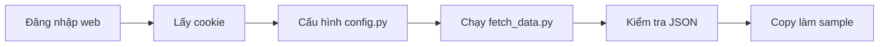
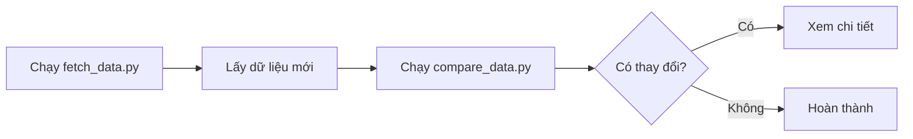

# 🖼️ Hướng Dẫn Có Hình Ảnh

## 📖 Tổng Quan Quy Trình


### Quy trình hoạt động:

1. **Đăng nhập** vào trang web bằng trình duyệt
2. Server tạo **session** và gửi **cookie** về
3. **Copy cookie** từ trình duyệt
4. **Paste vào script** Python
5. Script gửi request kèm cookie
6. Server nhận diện và trả về **JSON data**

---

## 🍪 Cách Lấy Cookie Từ Chrome


### Chi tiết từng bước:

1. **Mở Chrome DevTools:**
   - Nhấn `F12` hoặc
   - Click chuột phải → "Inspect"

2. **Chuyển sang tab Network:**
   - Click vào tab "Network" ở trên cùng
   - Nếu chưa có request nào, reload trang (`F5`)

3. **Chọn request:**
   - Click vào request đầu tiên trong danh sách
   - Hoặc bất kỳ request nào

4. **Tìm Cookie:**
   - Scroll xuống phần "Request Headers"
   - Tìm dòng bắt đầu bằng `Cookie:`

5. **Copy Cookie:**
   - Click chuột phải vào giá trị của Cookie
   - Chọn "Copy value"

---

## 📁 Cấu Trúc Thư Mục

```
learning_api_scraping/
│
├── 📄 README.md              # Hướng dẫn chi tiết
├── 📄 QUICKSTART.md          # Bắt đầu nhanh
├── 📄 EXERCISES.md           # Bài tập thực hành
├── 📄 VISUAL_GUIDE.md        # File này (hướng dẫn có hình)
│
├── 🐍 config.py              # Cấu hình (cookie, API URL)
├── 🐍 fetch_data.py          # Script lấy dữ liệu
├── 🐍 compare_data.py        # Script so sánh dữ liệu
│
├── 📦 run_daily.bat          # Batch file tự động hóa
│
├── 📂 data/
│   ├── sample_data.json      # Dữ liệu mẫu
│   ├── clone_list_sample.json  # Dữ liệu để so sánh
│   └── clone_list_latest.json  # Dữ liệu mới nhất
│
└── 📂 logs/
    └── run_history.log       # Lịch sử chạy
```

---

## 🔄 Workflow Thực Tế

### Lần đầu tiên:



### Lần sau:



---

## 💻 Ví Dụ Thực Tế

### 1. Cấu hình Cookie

**File: config.py**

```python
# ❌ SAI - Cookie chưa được thay
COOKIE = "YOUR_COOKIE_HERE"

# ✅ ĐÚNG - Cookie thật từ trình duyệt
COOKIE = "PHPSESSID=abc123def456; user_id=789; auth_token=xyz789"
```

### 2. Chạy Script

**Terminal:**

```bash
# Bước 1: Lấy dữ liệu
E:\BtrixTemp\local\learning_api_scraping> python fetch_data.py

🔄 Đang lấy dữ liệu từ API...
📄 Trang 1: Lấy được 100 records (0-100 / 1204)
📄 Trang 2: Lấy được 100 records (100-200 / 1204)
...
✅ Hoàn thành! Tổng cộng: 1204 records
💾 Đã lưu vào: data/clone_list_latest.json
```

### 3. So Sánh Dữ Liệu

```bash
# Bước 2: So sánh
E:\BtrixTemp\local\learning_api_scraping> python compare_data.py

📊 SO SÁNH DỮ LIỆU
📅 Thời gian lấy dữ liệu mẫu: 2026-01-04T09:00:00
📅 Thời gian lấy dữ liệu mới: 2026-01-04T23:42:00

📊 Số lượng records:
   - Dữ liệu mẫu: 1204 records
   - Dữ liệu mới:  1206 records

⚠️ PHÁT HIỆN THAY ĐỔI:
   + Thêm mới: 2 records
   - Xóa đi:   0 records

➕ RECORDS THÊM MỚI:
1. 17082 New Store MB 01
2. 17083 New Store MB 02
```

---

## 🎯 Checklist Từng Bước

### ☑️ Chuẩn Bị

- [ ] Cài Python (`python --version`)
- [ ] Cài requests (`pip install requests`)
- [ ] Có tài khoản đăng nhập vào `https://34.64.189.31`

### ☑️ Lần Đầu Tiên

- [ ] Đăng nhập vào trang web
- [ ] Mở DevTools (`F12`)
- [ ] Lấy cookie từ Network tab
- [ ] Mở `config.py`
- [ ] Paste cookie vào `COOKIE = "..."`
- [ ] Lưu file
- [ ] Chạy `python fetch_data.py`
- [ ] Kiểm tra file `data/clone_list_latest.json`
- [ ] Copy: `copy data\clone_list_latest.json data\clone_list_sample.json`

### ☑️ Lần Sau

- [ ] Chạy `python fetch_data.py`
- [ ] Chạy `python compare_data.py`
- [ ] Xem kết quả so sánh

### ☑️ Tự Động Hóa

- [ ] Mở Task Scheduler
- [ ] Tạo task mới
- [ ] Chọn `run_daily.bat`
- [ ] Lên lịch (ví dụ: 9:00 AM hàng ngày)
- [ ] Test chạy thử

---

## ⚠️ Xử Lý Lỗi

### Lỗi 1: Cookie chưa cấu hình

```
❌ LỖI: Bạn chưa cấu hình cookie!
```

**Giải pháp:**
1. Mở `config.py`
2. Thay `YOUR_COOKIE_HERE` bằng cookie thật
3. Lưu file

---

### Lỗi 2: Cookie hết hạn

```
❌ Lỗi: Status code 401
```

**Giải pháp:**
1. Đăng nhập lại vào trang web
2. Lấy cookie mới (theo hướng dẫn trên)
3. Cập nhật `config.py`

---

### Lỗi 3: Chưa cài requests

```
ModuleNotFoundError: No module named 'requests'
```

**Giải pháp:**
```bash
pip install requests
```

---

### Lỗi 4: File sample không tồn tại

```
❌ File không tồn tại: data\clone_list_sample.json
```

**Giải pháp:**
```bash
copy data\clone_list_latest.json data\clone_list_sample.json
```

---

## 🎓 Tips & Tricks

### 💡 Tip 1: Tăng tốc độ fetch

Mở `config.py`, thay đổi:

```python
PAGINATION = {
    "length": 100,  # Tăng lên 100 thay vì 10
}
```

→ Giảm số lần request, tăng tốc độ

---

### 💡 Tip 2: Kiểm tra cookie còn hạn không

Thử chạy script, nếu báo lỗi 401 → cookie hết hạn

---

### 💡 Tip 3: Backup dữ liệu

```bash
# Backup theo ngày
copy data\clone_list_latest.json data\backup_2026-01-04.json
```

---

### 💡 Tip 4: Xem log chi tiết

Mở file `logs\run_history.log` để xem lịch sử chạy

---

## 📚 Tài Liệu Liên Quan

- [README.md](README.md) - Hướng dẫn chi tiết đầy đủ
- [QUICKSTART.md](QUICKSTART.md) - Bắt đầu nhanh trong 5 phút
- [EXERCISES.md](EXERCISES.md) - Bài tập thực hành

---

## ❓ FAQ

**Q: Cookie có thời hạn bao lâu?**
A: Tùy server, thường vài giờ đến vài ngày.

**Q: Có thể dùng cookie của người khác không?**
A: Không nên, mỗi người nên dùng cookie của mình.

**Q: Script có thể chạy trên Mac/Linux không?**
A: Có, chỉ cần thay `run_daily.bat` bằng shell script.

**Q: Làm sao biết API có thay đổi không?**
A: Chạy `compare_data.py` sẽ thấy ngay.

---

**Chúc bạn học tốt! 🚀**

Nếu có thắc mắc, đọc lại README.md hoặc làm bài tập trong EXERCISES.md.
